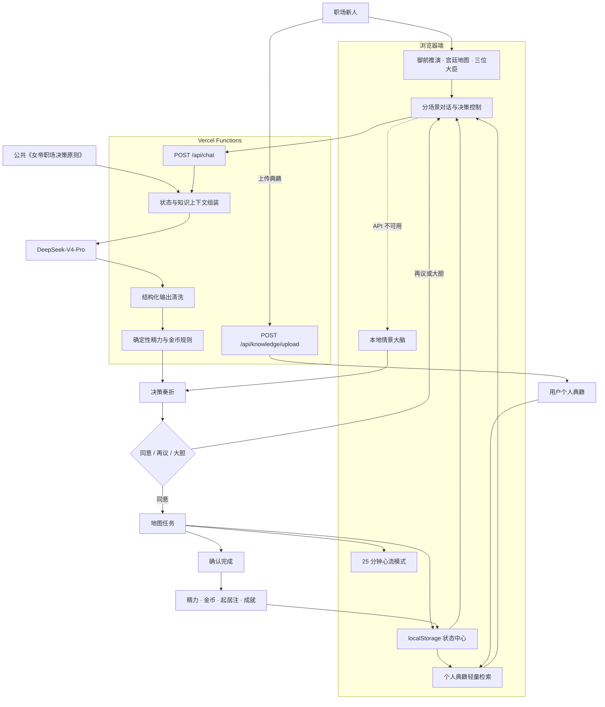

# 女皇入朝｜AI 职场心流决策地图

> 黑客松提交文案｜心流时间版本
> 最后整理：2026-07-20

## 一、提交清单

### 1. 项目名称

女皇入朝｜AI 职场心流决策地图

备选名称：

- 女皇入朝｜AI 职场心流决策地图
- 朱批｜AI 职场心流行动系统

### 2. 一句话介绍

AI 大臣帮职场新人看清投入、收益与机会成本，把纷乱的职场纠结变成一个值得专注、可以执行的下一步。

### 3. 对应时间命题

心流时间

### 4. 项目简介

#### 解决的问题

很多人无法进入心流，并不是缺少计时器，而是在开始之前就被大量未决事项占满了注意力：领导临时交办的任务要投入多少、同事的求助该不该接受、长期拖延的事情是否仍然重要，以及新任务会挤掉什么。普通 Todo 会把所有事情加入清单，通用 AI 的建议又容易停留在聊天中，用户依然无法确定此刻最值得专注的下一步。

#### 目标用户

项目核心面向实习生及入职 0—90 天的职场新人，并延伸至入职一年内、缺少稳定带教的用户。她们需要处理陌生流程、工作交付、人际协作和精力边界，也容易因为害怕表现不好、难以拒绝或过度追求完美，让注意力长期处于分散状态。

#### 项目亮点

「女皇入朝」没有再做一个普通番茄钟，而是把 AI 放在心流之前。用户可以选择直臣、顺臣或卦师，把正在占用注意力的事情交给 AI 大臣商议。AI 会结合当前入职阶段、精力、未完成任务、近期记录、公共决策原则和个人典籍，生成一份结构化奏折，明确呈现投入、收益、机会成本、推荐路径、备选路径和可执行任务。

用户通过“同意、再议、大胆”完成取舍，确认后的行动才会进入宫廷地图；系统还会检查现有待办，避免生成重复任务。完成决策后，用户可以把当前任务带入 25 分钟心流模式，让界面只保留眼前这一件事。任务完成后，系统依据固定规则结算精力、金币、30/60/90 天里程碑及珍宝阁的 59 项成就，形成“取舍—行动—专注—完成—反馈”的完整闭环。

#### 开发方案

前端采用原生 HTML、CSS 和 JavaScript，实现御前推演、八个宫廷场景、分场景对话、任务地图、心流模式、起居注和成就系统；用户状态、会话和个人知识保存在浏览器本地。服务端采用 Vercel Functions，提供 AI 对话和 TXT、Markdown、PDF 文字提取接口。

DeepSeek 返回的结构化结果会经过服务端字段清洗、来源核验和安全兜底。AI 只估算任务时长，精力、金币、恢复和成就奖励由程序通过确定性规则及幂等账本计算。AI 服务不可用时，系统自动切换至本地情景大脑，保证现场演示不中断。目前仓库共有 45 项程序自动化测试，全部通过。

#### AI 辅助方式

产品运行中使用 DeepSeek-V4-Pro 完成关键追问、机会成本分析、路径比较和结构化任务生成。AI 的作用不是替用户专注，而是减少进入心流前的决策负担，帮助用户关闭未决事项、明确边界，并找到唯一值得投入的下一步。

开发过程中使用 Codex 协助梳理产品与技术架构、实现前后端功能、接入模型与知识库、编写自动化测试及排查部署问题。最终的产品范围、交互规则、视觉表达和 AI 输出边界均由团队成员共同确定与验证。

### 5. 项目演示链接

<https://nvdi-career-decision.vercel.app>

### 6. 代码仓库

<https://github.com/april4xxxx/nvdi-career-decision>

### 7. AI 工具使用说明

DeepSeek-V4-Pro 是产品进入心流前的核心决策引擎。它结合用户问题、当前任务、精力、入职阶段、公共决策原则和个人典籍，完成关键追问、机会成本分析、路径比较及结构化任务生成。

AI 的作用不是替用户专注，而是降低进入专注前的决策负担。模型输出会直接转化为奏折和地图任务，用户确认后才能进入行动系统。AI 只估算任务时长；精力、金币、恢复和成就奖励均由程序按照固定规则及幂等账本计算，避免模型随意改变产品数值。

Codex 用于辅助产品与技术架构整理、前后端实现、DeepSeek 接入、知识库处理、自动化测试和部署排障。当前仓库共有 45 项程序自动化测试，全部通过。

### 8. 协作过程

> 提交前必须将成员占位符替换为真实姓名，并按照实际分工修改。

【成员 A】负责职场新人注意力问题调研、产品定义、决策规则、知识库、Prompt 和模型评测体系；【成员 B】负责女帝世界观、视觉素材、御前推演、宫廷地图与心流体验；【成员 C／成员 B】负责前后端实现、DeepSeek 接入、任务与成就系统、自动化测试及 Vercel 部署。团队共同完成场景验收和 Demo 打磨。

如果是两人团队，将研发部分合并到实际负责人名下。

### 9. 原创承诺

这一项无需另写文案。确认符合实际情况后，将提交页面中的三项声明全部勾选。

## 二、心流时间命题解释

### 核心判断

很多人无法进入心流，并不是不够专注，而是在开始之前，就被模糊目标、未决事项、外部请求和机会成本占满了注意力。

「女皇入朝」把 AI 放在心流之前：先完成取舍、明确边界、拆出唯一下一步，再由 25 分钟心流模式承接执行。

```text
看清取舍
→ 清除认知噪音
→ 明确单一任务
→ 进入专注
→ 获得完成反馈
```

### 路演解释

我们最初以为，进入心流只需要一个计时器。但在真实职场场景中，我们发现用户最大的障碍发生在计时之前：她不知道此刻该做什么，也不知道答应一件新任务会牺牲什么。

所以我们没有再做一个番茄钟，而是把 AI 放在心流之前。它先帮助用户看清投入、收益和机会成本，把模糊纠结变成一个有边界的下一步，再交给 25 分钟心流模式执行。

我们解决的不是“如何强迫自己专注”，而是“如何让注意力终于有一个值得投入的对象”。

## 三、评分标准对应关系

### 主题契合度

- 产品直接解决进入心流前的目标模糊、未决事项和注意力分散。
- 实现了真实的 25 分钟心流模式，而不是仅在文案中提及心流。
- 从决策、任务到专注和反馈形成完整链路。

### AI 创新性

- AI 不只聊天，而是输出结构化奏折并驱动地图任务。
- AI 结合当前状态、公共知识和个人典籍进行决策。
- 用户始终通过“同意、再议、大胆”保留最终决定权。
- 模型只估算时长，确定性程序负责资源与奖励结算。

### 完成度

- 线上 Demo 可访问。
- 已实现 Onboarding、真实 AI 对话、追问、奏折、朱批、地图任务、任务完成、心流模式、起居注、典籍上传和成就系统。
- AI 不可用时有本地情景大脑回退。
- 当前 45 项程序自动化测试全部通过。

### 用户价值

- 目标用户明确为实习及入职初期的职场新人。
- 对应领导临时任务、同事求助、过度准备、拖延和精力不足等真实问题。
- 帮助用户从“我该怎么办”走到“我现在专注完成哪一步”。

### 创意与表达

- 用女帝、朝堂、大臣、奏折和朱批映射职场决策。
- 八个宫廷场景承载不同类型任务。
- 59 项珍宝成就和 30/60/90 天里程碑提供持续反馈。

### 团队协作

- 提交时列明每位成员姓名、职责和具体交付物。
- 避免只写“共同完成”，需要体现产品、视觉、AI 与研发角色的真实贡献。

## 四、当前系统架构



## 五、测试与事实校准

### 程序自动化测试

运行命令：

```bash
npm test
```

当前结果：

```text
45 tests
45 pass
0 fail
```

### SOP 结构验证

运行命令：

```bash
npm run validate:sop
```

当前结果：

```text
22 个 SOP 模块
22 个测试案例
0 errors
0 warnings
```

### 对外表述边界

- 可以写“45 项程序自动化测试全部通过”。
- 可以写“项目具备版本化 SOP 发布门和结构验证”。
- 不应写“22 个 SOP 已经上线”。
- 当前 22 个 SOP 保持 `REVIEWED`，运行包为 0 个 `ACTIVE` 模块。
- 历史 DeepSeek 全量 DEV 为 87/108 通过，整体结论为 `FAIL`。
- 首批四模块的外部 HOLDOUT/SAFETY 因租户数据传输策略未执行，不能描述为已通过。
